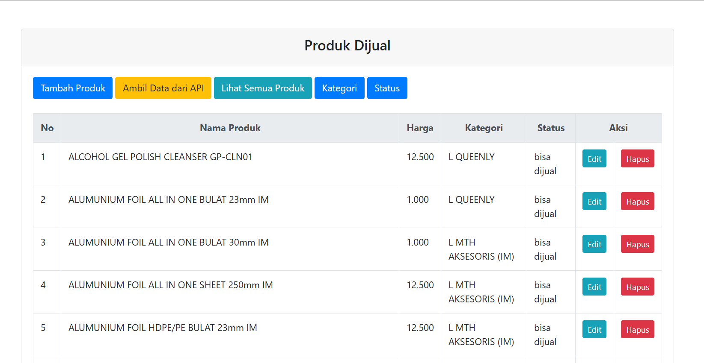
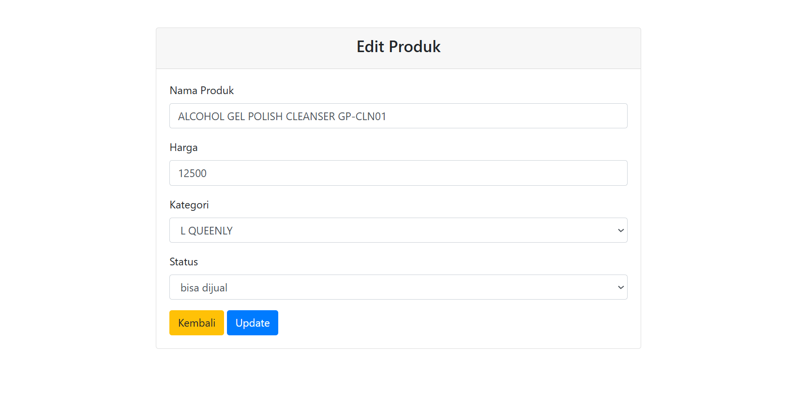
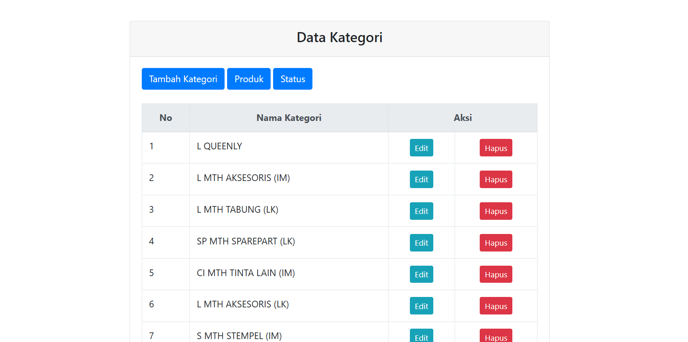
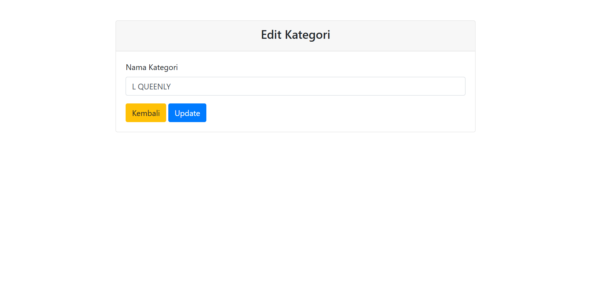

## Product App

#### Tes Junior Programmer

## Deskripsi Proyek
Aplikasi ini dibuat untuk mengambil data produk dari API yang disediakan, menyimpannya ke dalam database, dan menampilkannya melalui antarmuka web. Fitur yang tersedia meliputi:
- Menampilkan data produk
- Menampilkan produk yang bisa dijual
- Menambahkan, mengedit, dan menghapus produk, kategori dan status
- Validasi form input
- Konfirmasi sebelum menghapus data

## Teknologi yang Digunakan
- Framework: CodeIgniter 3
- Database: MySQL
- Bahasa Pemrograman: PHP
- API Client: cURL
- Frontend: Bootstrap

## API Endpoint
API yang digunakan:
```
https://recruitment.fastprint.co.id/tes/api_tes_programmer
```

### Authentication
- **Username:** `tesprogrammerDDMMYYCXX` (sesuai waktu server)
- **Password:** `md5('bisacoding-DD-MM-YY')`

## Instalasi & Konfigurasi
### 1. Clone Repository
```sh
git clone https://github.com/IrsyadHalimi/product_app.git
cd product_app
```

### 2. Konfigurasi Database
Buat database baru dan import tabel dengan struktur berikut:
```sql
CREATE TABLE kategori (
    id_kategori INT PRIMARY KEY AUTO_INCREMENT,
    nama_kategori VARCHAR(100) NOT NULL
);

CREATE TABLE status (
    id_status INT PRIMARY KEY AUTO_INCREMENT,
    nama_status VARCHAR(100) NOT NULL
);

CREATE TABLE produk (
    id_produk INT NOT NULL,
    nama_produk VARCHAR(255) NOT NULL,
    harga DECIMAL(10,2) NOT NULL,
    kategori_id INT,
    status_id INT,
    FOREIGN KEY (kategori_id) REFERENCES kategori(id_kategori),
    FOREIGN KEY (status_id) REFERENCES status(id_status)
);
```

### 3. Konfigurasi CodeIgniter
Sesuaikan file `application/config/database.php`:
```php
$active_group = 'default';
$query_builder = TRUE;

$db['default'] = array(
	'dsn'	=> '',
	'hostname' => 'localhost',
	'username' => 'root',
	'password' => '',
	'database' => 'nama_database',
	'dbdriver' => 'mysqli',
	'dbprefix' => '',
	'pconnect' => FALSE,
	'db_debug' => (ENVIRONMENT !== 'production'),
	'cache_on' => FALSE,
	'cachedir' => '',
	'char_set' => 'utf8',
	'dbcollat' => 'utf8_general_ci',
	'swap_pre' => '',
	'encrypt' => FALSE,
	'compress' => FALSE,
	'stricton' => FALSE,
	'failover' => array(),
	'save_queries' => TRUE
);
```

### 4. Jalankan Aplikasi

Buka di browser: `http://localhost:8080/product_app/`
Pastikan Port sudah sesuai (8080), atau ubah port base_url di file config: `product_app\application\config\config.php `

## Struktur Proyek
```
application/
├── config/
│   ├── autoload.php
│   ├── database.php
│   ├── routes.php
│
├── controllers/
│   ├── Category.php
│   ├── Product.php
│   ├── Status.php
│
├── models/
│   ├── Category_model.php
│   ├── Product_model.php
│   ├── Status_model.php
│
├── views/
│   ├── category
│   |  ├── create.php
│   |  ├── edit.php
│   |  ├── index.php
│   ├── product
│   |  ├── create.php
│   |  ├── edit.php
│   |  ├── index.php
│   |  ├── username_api_input.php
│	├── status
│   |  ├── create.php
│   |  ├── edit.php
│   |  ├── index.php
|	├── template
│   |  ├── footer.php
│   |  ├── header.php

```

## Fitur Utama
### 1. Mengambil Data dari API dan Menyimpan ke Database
```php
public function fetch_api() 
{
	$this->form_validation->set_rules('username', 'Username', 'required');
	$this->form_validation->set_message('required', '%s Harus Diisi.');

	if ($this->form_validation->run() == FALSE) {
		$data['errors'] = validation_errors();
		$this->load->view('template/header');
		$this->load->view('product/username_api_input', $data);
		$this->load->view('template/footer');
	} else {
		$username = $this->input->post('username');
		$password = md5("bisacoding-" . date("d") . "-" . date("m") . "-" . substr(date("Y"), 2));
		
		$url = "https://recruitment.fastprint.co.id/tes/api_tes_programmer";
		
		$postData = http_build_query([
			'username' => $username,
			'password' => $password
			]);
			
			$ch = curl_init();
			curl_setopt($ch, CURLOPT_URL, $url);
			curl_setopt($ch, CURLOPT_RETURNTRANSFER, true);
			curl_setopt($ch, CURLOPT_POST, true);
			curl_setopt($ch, CURLOPT_POSTFIELDS, $postData);
			curl_setopt($ch, CURLOPT_HTTPHEADER, [
			"Content-Type: application/x-www-form-urlencoded"
			]);
			
			$response = curl_exec($ch);
			
		if (curl_errno($ch)) {
			die("cURL Error: " . curl_error($ch));
		}

		curl_close($ch);

		$data = json_decode($response, true);
		if (json_last_error() !== JSON_ERROR_NONE) {
			die("JSON Decode Error: " . json_last_error_msg() . "<br>Response: " . htmlspecialchars($response));
		}

		if (isset($data['error']) && $data['error'] == 1) {
			die("API Error: " . $data['ket']);
		}

		if (isset($data['data']) && is_array($data['data'])) {
			foreach ($data['data'] as $item) {
				$existing_category = $this->Category_model->get_category_by_name($item['kategori']);
				$existing_status = $this->Status_model->get_status_by_name($item['status']);

				if (!$existing_category) {
				$category_id = $this->Category_model->insert_category(['nama_kategori' => $item['kategori']]);
				} else {
					$category_id = $existing_category['id_kategori'];
				}
				
				if (!$existing_status) {
					$status_id = $this->Status_model->insert_status(['nama_status' => $item['status']]);
				} else {
					$status_id = $existing_status['id_status'];
				}
				
				$existing_product = $this->Product_model->get_product_by_name($item['nama_produk']);
				
				if ($existing_product) {
				$update_data = [];

				if ($existing_product['harga'] != $item['harga']) {
					$update_data['harga'] = $item['harga'];
				}

				if (!empty($update_data)) {
					$this->Product_model->update_product($existing_product['id_produk'], $update_data);
				}
				} else {
					$this->Product_model->insert_product([
						'id_produk' => $item['id_produk'],
						'nama_produk' => $item['nama_produk'],
						'harga' => $item['harga'],
						'kategori_id' => $category_id,
						'status_id' => $status_id
					]);
				}
			}
		} else {
			die("Error: Data produk tidak ditemukan dalam respons API.");
		}
		redirect('product');
	}
}
```

### 2. Menampilkan Produk yang Bisa Dijual
```php
public function get_sell_product() 
{
	$this->db->select('produk.*, kategori.nama_kategori, status.nama_status');
	$this->db->from('produk');
	$this->db->join('kategori', 'kategori.id_kategori = produk.kategori_id', 'left');
	$this->db->join('status', 'status.id_status = produk.status_id', 'left');
	$this->db->where('status.nama_status', 'bisa dijual');
	return $this->db->get()->result_array();
}
```

### 3. CRUD Produk
- **Tambah Produk, Kategori, Status**
- **Edit Produk, Kategori, Status**
- **Hapus Produk, Kategori, Status dengan Konfirmasi**

## Class Diagram

## Flow Chart API Fetching


## Deployment
Untuk deployment ke server, gunakan langkah berikut:
1. Upload file project ke hosting
2. Sesuaikan `database.php` dengan konfigurasi server
3. Akses melalui domain hosting Anda

## Tampilan











*******************
#### What is CodeIgniter

CodeIgniter is an Application Development Framework - a toolkit - for people
who build web sites using PHP. Its goal is to enable you to develop projects
much faster than you could if you were writing code from scratch, by providing
a rich set of libraries for commonly needed tasks, as well as a simple
interface and logical structure to access these libraries. CodeIgniter lets
you creatively focus on your project by minimizing the amount of code needed
for a given task.

*******************
Release Information
*******************

This repo contains in-development code for future releases. To download the
latest stable release please visit the `CodeIgniter Downloads
<https://codeigniter.com/download>`_ page.

**************************
Changelog and New Features
**************************

You can find a list of all changes for each release in the `user
guide change log <https://github.com/bcit-ci/CodeIgniter/blob/develop/user_guide_src/source/changelog.rst>`_.

*******************
Server Requirements
*******************

PHP version 5.6 or newer is recommended.

It should work on 5.3.7 as well, but we strongly advise you NOT to run
such old versions of PHP, because of potential security and performance
issues, as well as missing features.

************
Installation
************

Please see the `installation section <https://codeigniter.com/userguide3/installation/index.html>`_
of the CodeIgniter User Guide.

*******
License
*******

Please see the `license
agreement <https://github.com/bcit-ci/CodeIgniter/blob/develop/user_guide_src/source/license.rst>`_.

*********
Resources
*********

-  `User Guide <https://codeigniter.com/docs>`_
-  `Contributing Guide <https://github.com/bcit-ci/CodeIgniter/blob/develop/contributing.md>`_
-  `Language File Translations <https://github.com/bcit-ci/codeigniter3-translations>`_
-  `Community Forums <http://forum.codeigniter.com/>`_
-  `Community Wiki <https://github.com/bcit-ci/CodeIgniter/wiki>`_
-  `Community Slack Channel <https://codeigniterchat.slack.com>`_

Report security issues to our `Security Panel <mailto:security@codeigniter.com>`_
or via our `page on HackerOne <https://hackerone.com/codeigniter>`_, thank you.

***************
Acknowledgement
***************

The CodeIgniter team would like to thank EllisLab, all the
contributors to the CodeIgniter project and you, the CodeIgniter user.
